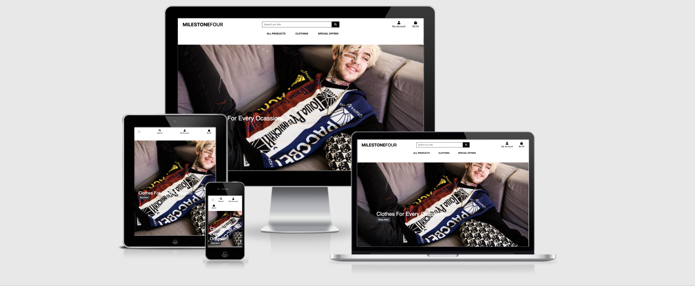

# Milestone-4
  
The image is from [Am I responsive?](http://ami.responsivedesign.is/)

the live website can be viewed [here](https://mls4-eb.herokuapp.com/)     

---
## Table of Contents
1. [**Why This Project**](#why-this-project) 
2. [**UX**](#ux)
    - [**Why This Project**](#why-this-project) 
    - [**User Stories**](#user-stories)
    - [**Design**](#desing)
    - [**Wireframes**](#wireframes)
    - [**Database Schema**](#database-schema)
3. [**Features**](#features)
    - [**Existing Features**](#existing-features)
    - [**Features Left to Implement**](#features-left-to-implement)
4. [**Technologies Used**](#technologies-used)
    - [**Languages**](#languages)
    - [**Libraries and Frameworks**](#libraries-and-frameworks)
    - [**Tools**](#tools)
    - [**Databases**](#databases)
    - [**Version Control**](#version-control)
    - [**Hosting**](#hosting)
5. [**Testing**](#testing)
    - [**Code Validation**](#code-validation)
    - [**Automated Testing**](#automated-testing)
    - [**Manual User Testing**](#manual-user-testing)
    - [**Interesting Bugs Or Problems**](#interesting-bugs-or-problems)
6. [**Deployment**](#deployment)
    - [**Local Deployment**](#local-deployment)
    - [**Remote Deployment**](#remote-deployment)
7. [**Credits**](#credits)
    - [**Content**](#content)
    - [**Acknowledgements**](#acknowledgements)
---

**Milestone 4** is a e-commerce website. 
This website for anyone who wants to buy designer clothes at fraction of the price you would pay in a retail store. It is an easy to use website that is user friendly.

---

## UX
### Why This Project
The aim of this project is to create a Full Stack web app to fully demonstrate the learnings throughout the course. 
A pass in this project is required to pass the course and obtain certification. 
The site will use Python and the Django Framework with a back-end db (PostgreSQL) for the back-end stack. 
Bootstrap 4, HTML and CSS3 will be used on the front-end design.
### Audience
- People who like designer clothes.
- People who want to buy product at fraction of thr price you would pay in a retail store.
- People who want up to date seasonal clothes.

### User Stories 
 **Viewing and Navegation** 
1 - This website is visual appealing and user friendly.
2 - The website is eay to use and navigate through with the noticable buttons and links.

**Registration and User accounts** 
3 - Easy to register/login due to the noticable icon on the right hand side of the page.
4 - Incase I forget my password it is easy to change it because of the forgot password link.
5 - After I registered I received an email confirmation just to let me know it was succesful in creating an account.
6 - I am able to view my order history just to let me know what I have purchased.

**Purchasing and Checkout**
7 -	Before purchasing I am given piece of mind knowing what size the clothes I am buying are due to to the easy to see size guide under the item.
8 - Easy to fill out delivery and card detail form that is user friendly and easy to navigate through.
9 - It is easy to see the total cost of the items and how much I will be spending in the checkout bag.
10 - It is easy to make changes to my purchase before checkout
11 - My account keeps the proof of what I've purchased.

**Admin and Store Management** 
12 - Add new services to my website easily.
13 - Change title, prices and description of services quickly and freely.
14 - Remove services that are not available

### Design
##### Framework
- [Bootstrap](https://www.bootstrapcdn.com/), front-end framework is chosen for this project for its easy to use documents and user friendly interface.
It is used for creating features such as navbar, cards, forms, modals, as well as for the layout.

- [JQuery](https://jquery.com/) is used for initializing some Bootstrap components, as well as for custom functions, DOM manipulation.

#### Colour Scheme
One of the main goals in UI was to focus user's attention on the UX design. Therefore the colors of the website are very important for grabing users attention one color (white) were mostly used accross the website's design.   
Different shades of white and black color and shadows allow us to create clean and neat backgrounds and volume effect accross the website.   
 
 

#### Typography
Original wireframes can be found [here]("").

#### Icons
Icons are used widely, as they are good attention grabbers. They help users to find and scan content quickly and easily. Another advantage of using them is to help to break language barriers. They create more user-friendly experience for people giving the visual clue about the subject.  

- I used [FontAwesome](https://fontawesome.com/) as the main icon library across the project (e.g. for social media links, forms, cart, search and user icons in navigation).

### Wireframes
[Balsamiq Wireframes](https://balsamiq.com/) tool was used to create all wireframes for the project.   
Original desktop wireframes can be found [here]("""") which were modified accordingly for mobile views.   
